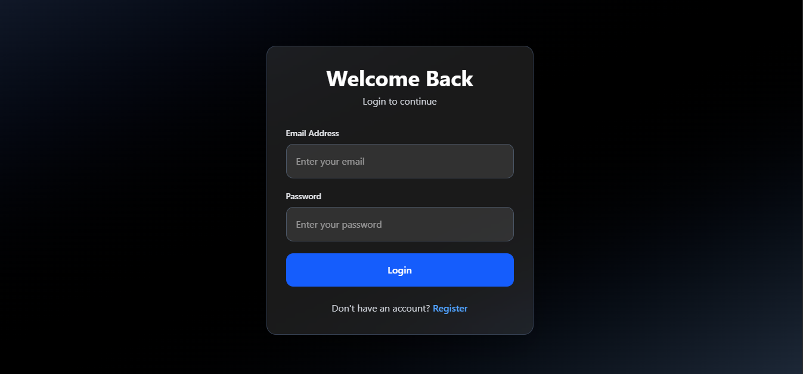
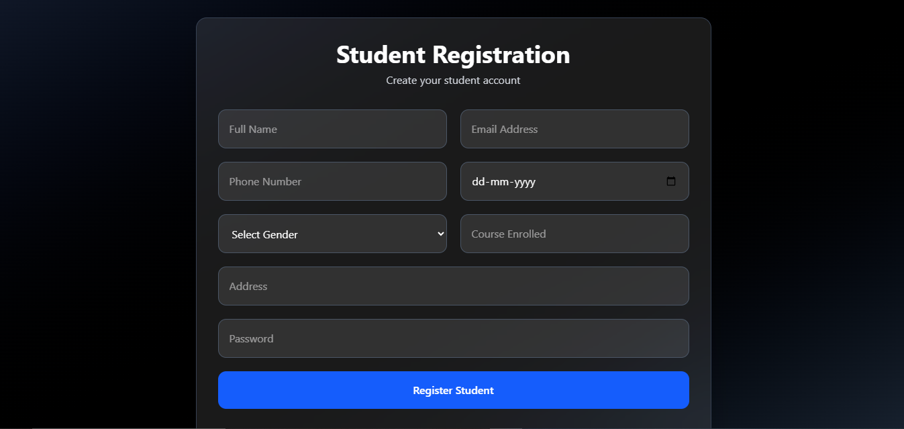
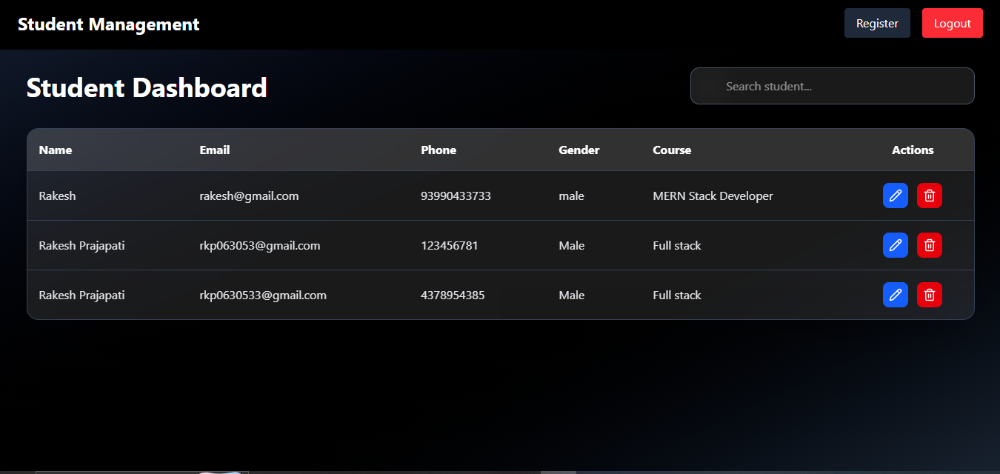
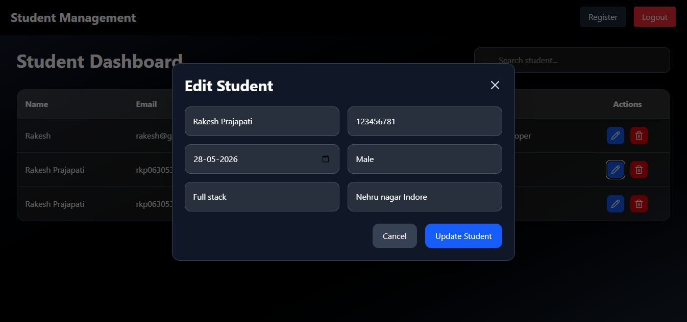

# Student Management System

A full-stack student management system built with React, TypeScript, Node.js, Express, and MongoDB.

---

# Screenshots

## Login Page



---

## Register Page



---

## Dashboard



---

## Edit Modal



---

# Tech Stack

## Frontend
- React
- TypeScript
- Tailwind CSS
- React Router
- Axios
- React Hot Toast

## Backend
- Node.js
- Express.js
- TypeScript
- MongoDB
- JWT Authentication
- CryptoJS

---

# Features

- Student Registration
- Student Login
- JWT Authentication
- Protected Routes
- CRUD Operations
- Search Functionality
- Modal Popup Editing
- Frontend Encryption
- Backend Encryption
- Double Encryption Architecture
- Responsive Dashboard UI

---

# Setup Instructions

## Backend

```bash
cd Backend

npm install

npm run dev
```

### Frontend

cd Frontend

npm install

npm run dev

---

## Environment Variables

### Backend .env

PORT=5000

MONGO_URI=mongodb://127.0.0.1:27017/studentdb

SECRET_KEY=mySuperSecretKey

JWT_SECRET=myJWTSuperSecretKey

JWT_EXPIRES_IN=1d

---

### Frontend .env

VITE_SECRET_KEY=mySuperSecretKey

VITE_API_URL=http://localhost:5000/api/v1

---

## API Routes

POST /api/v1/register

POST /api/v1/login

GET /api/v1/students

PUT /api/v1/student/:id

DELETE /api/v1/student/:id

---

## Encryption Flow

Frontend Encrypt -> Backend Encrypt -> MongoDB Store -> MongoDB -> Backend Decrypt -> Frontend Decrypt -> Display Data